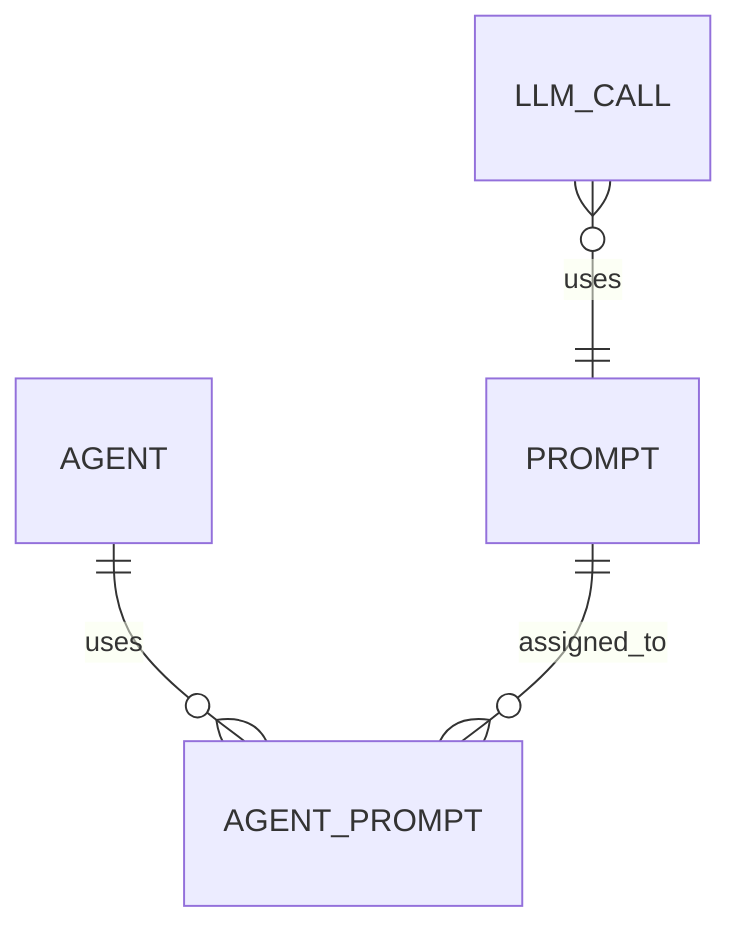

# Prompt Management and LLM Call Refactor Plan

## Objective

Simplify and future-proof prompt management by:
- Removing redundant prompt text storage on each LLM call.
- Tracking prompt usage via a foreign key (`prompt_id`) on `llm_calls`.
- Enabling analytics, versioning, and metrics through DB associations.
- Cleaning up legacy models and usage tracking.
- Allowing future extensibility for agent/prompt relationships.

---

## Step-by-Step Plan

### 1. Schema Migration

- **Add `prompt_id` to `llm_calls`:**
  - Type: `integer`, foreign key to `prompts`.
- **(Optional)**: Remove or deprecate the `prompt` text field from `llm_calls` for new records. Retain for backward compatibility if needed.

### 2. Model Updates

- In `app/models/llm_call.rb`:
  - Add `belongs_to :prompt, optional: true`.
  - Remove or stop using the `prompt` text field for new LLM calls—always use the association.

### 3. Prompt Fetching and Recording

- In `PromptService` and `UsesPrompts`:
  - Refactor so the render flow returns the prompt record (object), not just content.
  - Agents/services should access `prompt.id` for LLM call creation.
  - Remove any logic that stores prompt text directly in LLM call records.

### 4. Agent/LLM Call Logic

- In agent code (e.g., `base_agent.rb`’s `create_llm_call_record`):
  - Update LlmCall creation to set `prompt_id` (not prompt text).
  - Refactor any code referencing the old `prompt` text column.

### 5. Remove Legacy Tracking

- Remove PromptUsage and PromptEvaluation models and tables.

### 6. Documentation

- Clearly document that:
  - Prompt analytics/metrics are now derived via the LlmCall-to-Prompt association.
  - Prompt text is **not** duplicated on each call; only the prompt reference is stored.
  - Version info is accessed through the associated Prompt record.

### 7. Future-Proofing

- Any future circumstantial logic (e.g., agents using different prompts in different cases) can be handled with join tables or metadata fields as requirements emerge.

---

## Visual Model

---

## Integration Points

- **PromptService**: Always return the prompt record, not just rendered content.
- **UsesPrompts**: Ensure agent code can access prompt id after rendering.
- **Agent Code**: Pass prompt_id to LlmCall creation.
- **Legacy Models**: Remove PromptUsage and PromptEvaluation.

---

## Notes

- This lays the groundwork for advanced prompt analytics, versioning, and agent-prompt relationship modeling—without duplicating prompt text or relying on fragile join logic.
- Future enhancements can add metadata/context as needed.