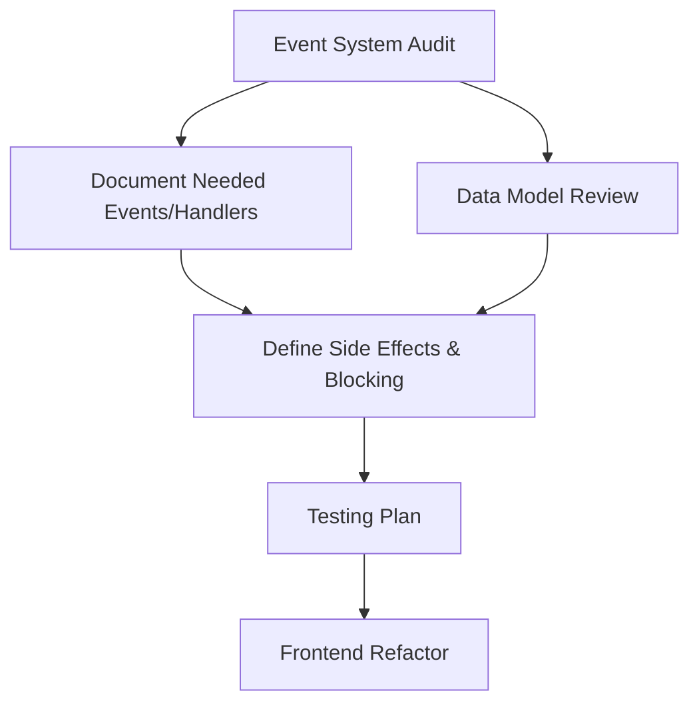

# Cleanup and Planning Workflow

This document outlines the prioritized steps for post-refactor cleanup and further architectural alignment, based on the current state of the project and outstanding todos.

---

### Event Types and Handler Mapping

**Event Types (from app/events/README.md):**
- Tool Events: `tool_execution.started`, `tool_execution.finished`, `tool_execution.error`
- Agent Events: `agent.started`, `agent.completed`, `agent.paused`, `agent.resumed`, `agent.requested_human`
- System Events: `system.startup`, `system.shutdown`, `system.error`, `system.config_changed`
- Task Events: `task.activated`, `task.paused`, `task.resumed`, `task.completed`, `task.failed`
- Project Events: `project.activated`, `project.paused`, `project.resumed`, `project.completed`, `project.recoordination_requested`, etc.
- Human Input Events: `human_input.requested`, `human_input.provided`, `human_input.ignored`
- Agent Activity Events: `agent_activity.created`, `agent_activity.completed`, `agent_activity.failed`
- LLM Call Events: `llm_call.completed`

**Handler/Event Mapping (from config/initializers/event_subscriptions.rb):**
- `ToolExecutionHandler`: Handles all ToolEvents (started, finished, error)
- `SystemEventHandler`: Handles all SystemEvents (startup, shutdown, error, config_changed)
- `AgentEventHandler`: Handles all AgentEvents (started, completed, paused, resumed, requested_human)
- `DashboardEventHandler`: Handles TaskEvents, ProjectEvents, Human Input Events, Agent Activity Events, LLM Call Events for real-time updates

This mapping provides a clear overview for auditing, extending, or refactoring the event system.
## 1. Event System Audit & Planning

- **Inventory all current events and handlers** in the codebase.
- **Brainstorm and document additional events and handlers** that may be needed for future extensibility.
- **For each event:**
  - Document intended side effects.
  - Decide if the event should be blocking or non-blocking (e.g., does human intervention block all tasks or just one?).
- **Create a matrix/table** mapping events to handlers, side effects, and blocking status.

---

## 2. Data Model Review

- **Investigate `contextable` and `ancestry` usage:**
  - Review if `contextable` is still needed after refactoring.
  - Assess the necessity of `ancestry` on `agent_activities`.
- **Clarify agent-task relationships:**
  - Confirm if one agent per task is sufficient.
  - Document logic for task/subtask relationships and blocking behavior.
  - Ensure the coordinator agent correctly handles task dependencies and ancestry.

---

## 3. Testing Plan

- **Define and document desired behaviors** for the new event system, including edge cases.
- **Develop or update tests** to cover all documented behaviors and ensure system resilience.

---

## 4. Frontend Alignment

- **Review the current frontend architecture** to assess how it displays and reacts to backend changes.
- **Plan updates** so the frontend is reactive and accurately reflects the new backend structure and event-driven workflows.

---

## Visual Workflow

---

## Next Steps

- Use this plan as a reference for implementation.
- Revisit and update as architectural decisions are made or new requirements emerge.