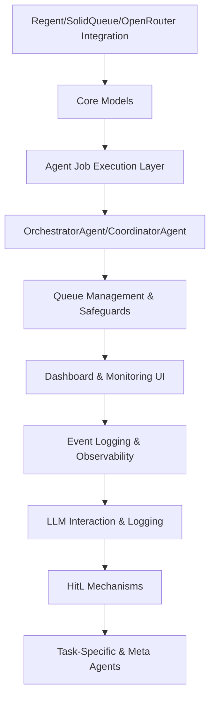

# ALWAYS

## Task 0

- Read docs in background_and_todo first, then look around the system as much as you need to determine next steps, add/or delete things in todo.md as necessary for your future self, create any documents in notes_to_self or open_questions as desired - and anytime significatn architechture is build, put a tech spec in the background_and_todo folder

- Start a todo item by making a branch in git, mark a todo item as pending completion that branch is finished - Human In The Loop will mark completed when he merges it back to main

## TODO

Here is the revised plan for the first 10 high-level tasks, incorporating your feedback:

---

(Preliminary: Review regent gem docs and functionality and summarize its API - we are using our own fork upto date with main incase we need to make any changes but open_router should
be able to be used as open ai compatible)

**2. Set Up Core Infrastructure: Regent/SolidQueue/Event Bus/OpenRouter Integration**
  - Integrate and configure Regent as the event bus within Rails. (REVIEW: agent_implementation.md)
    - _Acceptance: Regent is initialized, can publish/subscribe events from Rails._
  - Wrap Regent for idiomatic Rails use; bridge events to Solid Queue jobs.[Setup solid queue if necessary and set up mission_control-jobs dashboard in admin namespace without any customization for now]
    - _Acceptance: Event publish triggers jobs, and jobs emit events._
  - Set up OpenRouter integration (basic call/test and model defaults/overides)
    - _Acceptance: System can make authenticated OpenRouter calls from jobs/services.

**3. Set Up Agent Job Execution Layer**
  - Implement base Agent job class (app/jobs/agents/).
    - _Acceptance: Jobs can be enqueued/executed as agents._
  - Add support for job arguments (agent type, context, task ID).
    - _Acceptance: Jobs receive and use arguments correctly._
  - Integrate Ractors for agent job isolation.
    - _Acceptance: Multiple jobs run in parallel without interference._

---

**4. Build OrchestratorAgent and CoordinatorAgent**
  - Implement short-lived OrchestratorAgent (spawned by event or recurring job).
    - _Acceptance: OrchestratorAgent can spawn, act, and terminate._
  - Implement CoordinatorAgent for task delegation.
    - _Acceptance: CoordinatorAgent assigns subtasks and updates state._
  - Configure orchestration queue with highest priority.
    - _Acceptance: OrchestratorAgent jobs run promptly when scheduled._

---

**5. Implement Queue Management and Safeguards**
  - Assign unique queues for each agent type in Solid Queue.
    - _Acceptance: Jobs routed to correct queues._
  - Enforce concurrency limits and spawn depth per queue.
    - _Acceptance: Cannot exceed configured parallel agents per type._
  - Add circuit-breaker and resource monitor agents.
    - _Acceptance: System halts or alerts if runaway spawn detected._

---

**6. Develop Dashboard and Monitoring UI**
  - Scaffold Rails dashboard and metrics views (app/controllers/dashboard/).
    - _Acceptance: Dashboard displays core agent/job stats._
  - Integrate Turbo Streams for real-time updates.
    - _Acceptance: UI updates without reload on job or agent changes._
  - Display HitL events and allow human responses.
    - _Acceptance: Clarification requests/inputs visible and actionable in UI._

---

**7. Integrate Observability and Event Logging**
  - Bridge events to Rails logging and Turbo dashboard.
    - _Acceptance: Event triggers visible in logs and UI._
  - Implement Event model for persistent event history.
    - _Acceptance: All key events stored and queryable._

---

**8. Implement LLM Interaction and Logging**
  - Create OpenRouterCallAgent for LLM API requests.
    - _Acceptance: LLM calls executed and validated via agent job._
  - Persist all LLM requests/responses to LlmCall model.
    - _Acceptance: Full request/response data stored._
  - Add LlmLogAgent for dashboard stats and summaries.
    - _Acceptance: LLM metrics visible in dashboard._

---

**9. Build Human-in-the-Loop (HitL) Mechanisms**
  - Implement soft and harsh clarification events with pausing/resumption.
    - _Acceptance: Jobs pause/resume on harsh events; proceed on soft events._
  - Create ClarificationRequest model and UI form.
    - _Acceptance: Requests logged, and responses update job flow._
  - Add external notifications (email/Slack) for harsh/system events.
    - _Acceptance: Alerts sent upon harsh/system-wide HitL requests._

---

**10. Add Task-Specific and Meta Agents**
  - Develop ResearchAgent, WebScrapingAgent, SummarizerAgent, etc.
    - _Acceptance: Each agent type performs its core function and logs status._
  - Add meta-agents: ResourceMonitorAgent, RoutingAgent.
    - _Acceptance: Meta-agents monitor system health and control agent flows._
  - Validate spawn control by simulating runaway agent scenarios.
    - _Acceptance: System prevents/halts runaway spawns and recovers cleanly._

---

**Mermaid Diagram: Task/Dependency Flow**

### FINISHED

- scaffolded rails app installed nec gems, etc

**1. Define and Implement Core Models**
  - Create Task, AgentActivity, LlmCall, and Event models.
  - _Acceptance: Models exist with basic attributes and associations._
  - Add state machine to Task (pending, active, waiting_on_human, completed, failed).
  - _Acceptance: Task state transitions enforced and tested._
  - Ensure AgentActivity supports parent/child relationships.
  - _Acceptance: AgentActivity can represent event flow ancestry._
