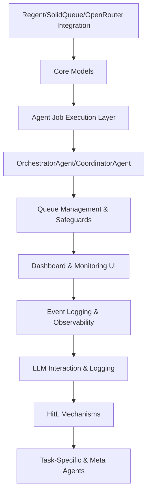

# ALWAYS

## Task 0

- Read docs in background_and_todo first, then look around the system as much as you need to determine next steps, add/or delete things in todo.md as necessary for your future self, create any documents in notes_to_self or open_questions as desired - and anytime significatn architechture is build, put a tech spec in the background_and_todo folder

- Start a todo item by making a branch in git, mark a todo item as pending completion that branch is finished - Human In The Loop will mark completed when he merges it back to main

## TODO

Here is the revised plan for the first 10 high-level tasks, incorporating your feedback:

---

(Preliminary: Review regent gem docs and functionality and summarize its API - we are using our own fork upto date with main incase we need to make any changes but open_router should
be able to be used as open ai compatible)

**4. Build OrchestratorAgent and CoordinatorAgent**
  - Implement short-lived OrchestratorAgent (spawned by event or recurring job).
    - _Acceptance: OrchestratorAgent can spawn, act, and terminate._
  - Implement CoordinatorAgent for task delegation.
    - _Acceptance: CoordinatorAgent assigns subtasks and updates state._
  - Configure orchestration queue with highest priority.
    - _Acceptance: OrchestratorAgent jobs run promptly when scheduled._

We will use this to build code_writing, code_research, code_review, and code_testing agents. to build out the rest of this app

As you flesh out the OrchestrationAgent and middle-managers for tasks think through how event pub/sub will work, how we will create custom tools for Regent, etc etc etc

Overview Of Work so far

1. **Solid Foundation with Rails**
   - Good choice leveraging Rails for a mature foundation with database integration, job queuing, and application structure

2. **Agent Hierarchy**
   - Clean inheritance pattern with `BaseAgent` providing shared functionality
   - Specialized agents with clear responsibilities (Orchestrator, Coordinator, Interview)
   - Integration with Regent for LLM interactions

3. **Job System Implementation**
   - Well-structured queue management with SolidQueue
   - Per-agent queue configuration with concurrency limits
   - Good error handling and job status tracking

4. **Task Management**
   - State machine implementation using AASM
   - Hierarchical task structure with subtask capabilities
   - Activity tracking per task

5. **Logging and Monitoring**
   - Comprehensive LLM call logging
   - Agent activity tracking with detailed event recording
   - Session trace capture for debugging

## Gaps and Areas for Improvement

1. **Event-Driven Architecture**
   - **Critical Gap**: The core pub/sub event system for agent communication isn't fully implemented
   - Events are currently used mostly for logging rather than driving inter-agent workflow
   - Need to implement true event subscriptions and handlers

2. **Schema Validation**
   - No integration with dry-schema/dry-types as specified
   - Missing structured validation for agent inputs/outputs
   - Tool interfaces lack formal schema definitions

3. **Tool Architecture**
   - Tools are embedded in agent classes rather than as independent components
   - No clear separation between tool definition and implementation
   - Missing the tool registry system mentioned in the spec

4. **Human-in-the-Loop**
   - Task has `waiting_on_human` state but missing the soft/hard clarification interfaces
   - No dashboard implementation for human interaction
   - Missing timeout handling for human responses

5. **State Management**
   - Currently relies entirely on database for state
   - Missing Redis integration for ephemeral state
   - No clear strategy for managing large context windows between agent invocations

6. **Dashboard & Monitoring**
   - No implementation of the real-time dashboard using Turbo Streams
   - Missing cost tracking and visualization
   - No interface for human intervention

7. **Vector Database**
   - No integration with vector databases for semantic search
   - Missing document storage capabilities

## Implementation Concerns

1. **Ractor Usage**
   - `maybe_with_ractor` is experimental and has significant limitations
   - Many Ruby objects cannot be shared between Ractors
   - Consider alternative isolation patterns or thorough testing before relying on this

2. **Concurrency Management**
   - Semaphore-based concurrency is good but needs careful timeout handling
   - No circuit breaker implementation for cascading failure prevention
   - `with_concurrency_control` could deadlock under certain conditions

3. **AgentActivity Overloading**
   - This model handles too many responsibilities (activity tracking, parent-child relationships, result storage)
   - Consider splitting into more focused models as the system grows

4. **Error Handling**
   - Basic error catching exists but missing structured error recovery strategies
   - No retry strategies with exponential backoff
   - Missing global error monitoring and alerting

## Recommendations

1. **Implement True Event System**
   - Create a dedicated `EventBus` class for pub/sub functionality
   - Add event subscription capabilities to agents
   - Enable event-driven workflows between agents

2. **Add Schema Validation**
   - Integrate dry-schema for input/output validation
   - Define clear interfaces for tool inputs/outputs
   - Implement response validation with feedback loops

3. **Restructure Tool System**
   - Extract tools into standalone classes
   - Create a tool registry system
   - Enable dynamic tool discovery and usage

4. **Enhance Human Interaction**
   - Implement both blocking and non-blocking clarification interfaces
   - Create a user-friendly dashboard for interactions
   - Add timeout handling and escalation policies

5. **Improve State Management**
   - Integrate Redis for ephemeral state
   - Implement strategies for large context persistence
   - Add state versioning for backwards compatibility

6. **Build Dashboard & Monitoring**
   - Create Turbo Stream-based real-time dashboard
   - Implement cost tracking and visualization
   - Add system health monitoring

7. **Consider Scaling Strategy**
   - Define clear boundaries for horizontal scaling
   - Implement proper resource limits
   - Add cost control mechanisms

Overall, the implementation provides a solid foundation but needs significant development to match the complete vision outlined in the technical specification. The core agent and job architecture is well-structured, but the event-driven nature of the system requires more attention to fulfill the original design goals.
---

**5. Implement Queue Management and Safeguards**
  - Assign unique queues for each agent type in Solid Queue.
    - _Acceptance: Jobs routed to correct queues._
  - Enforce concurrency limits and spawn depth per queue.
    - _Acceptance: Cannot exceed configured parallel agents per type._
  - Add circuit-breaker and resource monitor agents.
    - _Acceptance: System halts or alerts if runaway spawn detected._

---

**6. Develop Dashboard and Monitoring UI**
  - Scaffold Rails dashboard and metrics views (app/controllers/dashboard/).
    - _Acceptance: Dashboard displays core agent/job stats._
  - Integrate Turbo Streams for real-time updates.
    - _Acceptance: UI updates without reload on job or agent changes._
  - Display HitL events and allow human responses.
    - _Acceptance: Clarification requests/inputs visible and actionable in UI._

---

**7. Integrate Observability and Event Logging**
  - Bridge events to Rails logging and Turbo dashboard.
    - _Acceptance: Event triggers visible in logs and UI._
  - Implement Event model for persistent event history.
    - _Acceptance: All key events stored and queryable._

---

**8. Implement LLM Interaction and Logging**
  - Create OpenRouterCallAgent for LLM API requests.
    - _Acceptance: LLM calls executed and validated via agent job._
  - Persist all LLM requests/responses to LlmCall model.
    - _Acceptance: Full request/response data stored._
  - Add LlmLogAgent for dashboard stats and summaries.
    - _Acceptance: LLM metrics visible in dashboard._

---

**9. Build Human-in-the-Loop (HitL) Mechanisms**
  - Implement soft and harsh clarification events with pausing/resumption.
    - _Acceptance: Jobs pause/resume on harsh events; proceed on soft events._
  - Create ClarificationRequest model and UI form.
    - _Acceptance: Requests logged, and responses update job flow._
  - Add external notifications (email/Slack) for harsh/system events.
    - _Acceptance: Alerts sent upon harsh/system-wide HitL requests._

---

**10. Add Task-Specific and Meta Agents**
  - Develop ResearchAgent, WebScrapingAgent, SummarizerAgent, etc.
    - _Acceptance: Each agent type performs its core function and logs status._
  - Add meta-agents: ResourceMonitorAgent, RoutingAgent.
    - _Acceptance: Meta-agents monitor system health and control agent flows._
  - Validate spawn control by simulating runaway agent scenarios.
    - _Acceptance: System prevents/halts runaway spawns and recovers cleanly._

---

**Mermaid Diagram: Task/Dependency Flow**

### FINISHED

- scaffolded rails app installed nec gems, etc

**1. Define and Implement Core Models**
  - Create Task, AgentActivity, LlmCall, and Event models.
  - _Acceptance: Models exist with basic attributes and associations._
  - Add state machine to Task (pending, active, waiting_on_human, completed, failed).
  - _Acceptance: Task state transitions enforced and tested._
  - Ensure AgentActivity supports parent/child relationships.
  - _Acceptance: AgentActivity can represent event flow ancestry._
