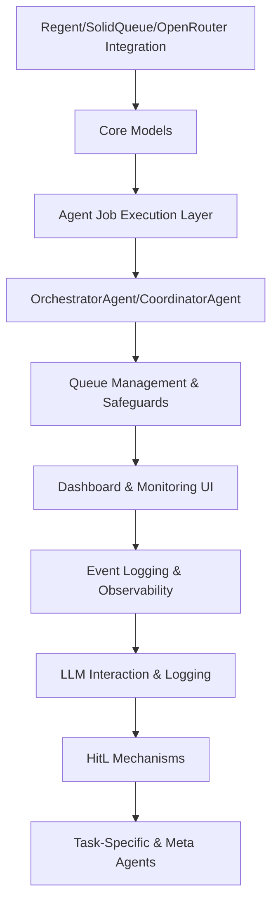

# ALWAYS

## Task 0

- Read docs in background_and_todo first, then look around the system as much as you need to determine next steps, add/or delete things in todo.md as necessary for your future self, create any documents in notes_to_self or open_questions as desired - and anytime significatn architechture is build, put a tech spec in the background_and_todo folder

- Start a todo item by making a branch in git, mark a todo item as pending completion that branch is finished - Human In The Loop will mark completed when he merges it back to main

## TODO

NEXT TASKS:

1) Make sure all our agents are well tested with their event handlers and flow, we can use real LLM calls and make sure they work as they will be recorded with VCR

Consider these high level feature specs

2) Build our dashboard for visibility and allow to kick off projects
    - Dashboard controller (dashboard_controller.rb) and views not implemented yet
    - TODO:
        - Scaffold DashboardController and routes
        - Create app/views/dashboard/ with initial metrics views
        - Integrate Turbo Streams for real-time updates
        - Add UI for agent/job stats and status
        - Display HitL (Human-in-the-Loop) events and allow human responses
        - Provide project/task kickoff capability from dashboard UI
        - Integrate cost tracking/visualization
        - Add system health monitoring

Then we'll focus on improvements in the overview below

3) Integrate dry-schema/dry-types/dry-validation for agent/tool input/output validation
    - Define schemas for agent and tool interfaces
    - Update agent/tool base classes to enforce input/output validation
    - Add validation tests for agents and tools
    - Document interfaces and provide examples in code/docs

## 1. Overview

This analysis provides a comprehensive review of the agent-driven architecture within a Rails application designed to coordinate autonomous AI agents for project-based research and automation tasks. The review catalogs the application''s models, agents, tools, and their integration with the LangChain.rb framework, evaluates the current workflows, and offers actionable recommendations for improvement based on the latest best practices and LangChain.rb capabilities.

---

## 2. Key Findings

### 2.1 Architecture and Design

- **Separation of Concerns:** The application demonstrates a clear division between domain models, agent logic, tool implementations, and infrastructure services, supporting maintainability and scalability.
- **Modular & Event-Driven:** Agents and tools are implemented as modular, reusable components, coordinated via an event-driven and service-oriented architecture.
- **Asynchronous Processing:** Agent execution is handled through background jobs, enabling parallelism and responsiveness.
- **Traceability:** Comprehensive tracking is in place through models such as `AgentActivity`, `LlmCall`, and `Event`, ensuring robust auditability of agent actions and system events.

### 2.2 Implementation Details

- **Models:** Core entities include `Project`, `Task`, `AgentActivity`, `LlmCall`, `HumanInputRequest`, `HumanIntervention`, `VectorEmbedding`, and `Event`, each fulfilling a distinct role in the orchestration and tracking of agent-driven workflows.
- **Agents:** Agents inherit from a common `BaseAgent` class, utilize a DSL for tool invocation, and are specialized for tasks such as orchestration, research, and summarization.
- **Tools:** Tools are encapsulated as Ruby classes (e.g., `ShellTool`, `WebScraperTool`, `ResearchTool`) and provide operational capabilities to agents.
- **Services & Jobs:** Infrastructure services (e.g., `ErrorHandler`, `EventBus`) and background jobs (`Agents::AgentJob`) support error management, event coordination, and asynchronous execution.

### 2.3 Workflow

1. **Project & Task Creation:** Users initiate projects and define tasks.
2. **Orchestration:** The `OrchestratorAgent` coordinates task execution, spawning specialized agents as needed.
3. **Tool Invocation:** Agents utilize modular tools to perform actions, leveraging a shared DSL.
4. **Activity Logging:** All agent actions and tool invocations are logged for traceability.
5. **Human-in-the-Loop:** The system supports human interventions when required, integrating manual input into autonomous workflows.
6. **Error Handling & Event Propagation:** Errors are centrally managed and state changes are propagated via an event bus.

---

## 3. Insights & Evaluation

### 3.1 Strengths

- **Robust Modularity:** The system''s modular approach to agents and tools facilitates reuse and extensibility.
- **Scalability:** Asynchronous, event-driven design supports high throughput and future growth.
- **Comprehensive Tracking:** Detailed activity and event logging enhance transparency and debugging.
- **Centralized Error Handling:** Errors are managed in a standardized, maintainable manner.

### 3.2 Areas for Improvement

- **Documentation:** While some high-level documentation exists, inline code comments and method-level documentation are lacking, especially for complex agent-tool interactions.
- **Testing:** The extent of automated test coverage is unclear; critical workflows and infrastructure require thorough testing.
- **Abstraction:** Some tool implementations contain duplicated logic and implicit contracts, indicating opportunities for further abstraction and interface definition.
- **Agent Representation:** The absence of an explicit `Agent` model may limit extensibility and introspection.
- **Human-in-the-Loop UX:** The workflow for human interventions could benefit from improved documentation and user interface enhancements.

### 3.3 Workflow vs. Agent Coordination

- The current approach leverages agents for both orchestration and execution, with workflows coordinated through asynchronous jobs and events. While effective, further abstraction of workflow management (potentially leveraging LangChain.rb''s latest workflow capabilities) could enhance flexibility and maintainability.

---

## 4. Recommendations

1. **Enhance Documentation:** Expand inline comments, architectural overviews, and method documentation, particularly for agent and tool DSLs.
2. **Increase Test Coverage:** Implement comprehensive tests for agents, tools, and error handling; utilize mocks/stubs for external dependencies.
3. **Abstract Tool Interfaces:** Define explicit interfaces or base classes for tools to reduce coupling and clarify usage contracts.
4. **Refactor Duplicated Logic:** Consolidate repeated code in tool implementations into shared modules or concerns.
5. **Introduce Explicit Agent Model:** Add an `Agent` model to represent agent types, configurations, and metadata, improving extensibility.
6. **Improve Human-in-the-Loop Experience:** Clarify and enhance documentation and UI for human intervention workflows.
7. **Leverage Latest LangChain.rb Features:** Evaluate and integrate new LangChain.rb functionalities for workflow management, tool abstraction, and agent orchestration.
8. **Standardize Agent Lifecycle:** Implement standardized lifecycle hooks in `BaseAgent` for consistent agent management.
9. **Centralize Tool Registry:** Create a dynamic registry for tool discovery and configuration.
10. **Strengthen Event System:** Document event types and consider a typed event system for improved maintainability.

---

## 5. Conclusion

The Rails application presents a strong foundation for coordinating autonomous AI agents using modular tools and robust infrastructure. By addressing documentation, abstraction, and testing gaps—and by leveraging the latest advancements in LangChain.rb—the system can be further enhanced for scalability, maintainability, and extensibility, positioning it as a leading platform for agent-driven automation and research workflows.', 3587, NULL, NULL, NULL, NULL, '2025-04-14 22:33:32.306448', '2025-04-14 22:33:32.306448', 2439, 1148) RETURNING "id" /*application='Orch3stra1Ag3nt',job='Agents%3A%3AAgentJob'*/
  TRANSACTION (0.7ms)  COMMIT /*application='Orch3stra1Ag3nt',job='Agents%3A%3AAgentJob'*/
  TRANSACTION (0.2ms)  BEGIN /*application='Orch3stra1Ag3nt',job='Agents%3A%3AAgentJob'*/
  Task Update (1.5ms)  UPDATE "tasks" SET "updated_at" = '2025-04-14 22:33:32.323137', "result" = '# Executive Summary: Analysis of Agent Implementation in Rails Application

## 1. Overview

This analysis provides a comprehensive review of the agent-driven architecture within a Rails application designed to coordinate autonomous AI agents for project-based research and automation tasks. The review catalogs the application''s models, agents, tools, and their integration with the LangChain.rb framework, evaluates the current workflows, and offers actionable recommendations for improvement based on the latest best practices and LangChain.rb capabilities.

---

## 2. Key Findings

### 2.1 Architecture and Design

- **Separation of Concerns:** The application demonstrates a clear division between domain models, agent logic, tool implementations, and infrastructure services, supporting maintainability and scalability.
- **Modular & Event-Driven:** Agents and tools are implemented as modular, reusable components, coordinated via an event-driven and service-oriented architecture.
- **Asynchronous Processing:** Agent execution is handled through background jobs, enabling parallelism and responsiveness.
- **Traceability:** Comprehensive tracking is in place through models such as `AgentActivity`, `LlmCall`, and `Event`, ensuring robust auditability of agent actions and system events.

### 2.2 Implementation Details

- **Models:** Core entities include `Project`, `Task`, `AgentActivity`, `LlmCall`, `HumanInputRequest`, `HumanIntervention`, `VectorEmbedding`, and `Event`, each fulfilling a distinct role in the orchestration and tracking of agent-driven workflows.
- **Agents:** Agents inherit from a common `BaseAgent` class, utilize a DSL for tool invocation, and are specialized for tasks such as orchestration, research, and summarization.
- **Tools:** Tools are encapsulated as Ruby classes (e.g., `ShellTool`, `WebScraperTool`, `ResearchTool`) and provide operational capabilities to agents.
- **Services & Jobs:** Infrastructure services (e.g., `ErrorHandler`, `EventBus`) and background jobs (`Agents::AgentJob`) support error management, event coordination, and asynchronous execution.

### 2.3 Workflow

1. **Project & Task Creation:** Users initiate projects and define tasks.
2. **Orchestration:** The `OrchestratorAgent` coordinates task execution, spawning specialized agents as needed.
3. **Tool Invocation:** Agents utilize modular tools to perform actions, leveraging a shared DSL.
4. **Activity Logging:** All agent actions and tool invocations are logged for traceability.
5. **Human-in-the-Loop:** The system supports human interventions when required, integrating manual input into autonomous workflows.
6. **Error Handling & Event Propagation:** Errors are centrally managed and state changes are propagated via an event bus.

---

## 3. Insights & Evaluation

### 3.1 Strengths

- **Robust Modularity:** The system''s modular approach to agents and tools facilitates reuse and extensibility.
- **Scalability:** Asynchronous, event-driven design supports high throughput and future growth.
- **Comprehensive Tracking:** Detailed activity and event logging enhance transparency and debugging.
- **Centralized Error Handling:** Errors are managed in a standardized, maintainable manner.

### 3.2 Areas for Improvement

- **Documentation:** While some high-level documentation exists, inline code comments and method-level documentation are lacking, especially for complex agent-tool interactions.
- **Testing:** The extent of automated test coverage is unclear; critical workflows and infrastructure require thorough testing.
- **Abstraction:** Some tool implementations contain duplicated logic and implicit contracts, indicating opportunities for further abstraction and interface definition.
- **Agent Representation:** The absence of an explicit `Agent` model may limit extensibility and introspection.
- **Human-in-the-Loop UX:** The workflow for human interventions could benefit from improved documentation and user interface enhancements.

### 3.3 Workflow vs. Agent Coordination

- The current approach leverages agents for both orchestration and execution, with workflows coordinated through asynchronous jobs and events. While effective, further abstraction of workflow management (potentially leveraging LangChain.rb''s latest workflow capabilities) could enhance flexibility and maintainability.

---

## 4. Recommendations

1. **Enhance Documentation:** Expand inline comments, architectural overviews, and method documentation, particularly for agent and tool DSLs.
2. **Increase Test Coverage:** Implement comprehensive tests for agents, tools, and error handling; utilize mocks/stubs for external dependencies.
3. **Abstract Tool Interfaces:** Define explicit interfaces or base classes for tools to reduce coupling and clarify usage contracts.
4. **Refactor Duplicated Logic:** Consolidate repeated code in tool implementations into shared modules or concerns.
5. **Introduce Explicit Agent Model:** Add an `Agent` model to represent agent types, configurations, and metadata, improving extensibility.
6. **Improve Human-in-the-Loop Experience:** Clarify and enhance documentation and UI for human intervention workflows.
7. **Leverage Latest LangChain.rb Features:** Evaluate and integrate new LangChain.rb functionalities for workflow management, tool abstraction, and agent orchestration.
8. **Standardize Agent Lifecycle:** Implement standardized lifecycle hooks in `BaseAgent` for consistent agent management.
9. **Centralize Tool Registry:** Create a dynamic registry for tool discovery and configuration.
10. **Strengthen Event System:** Document event types and consider a typed event system for improved maintainability.

---

## 5. Conclusion

The Rails application presents a strong foundation for coordinating autonomous AI agents using modular tools and robust infrastructure. By addressing documentation, abstraction, and testing gaps—and by leveraging the latest advancements in LangChain.rb—the system can be further enhanced for scalability, maintainability, and extensibility, positioning it as a leading platform for agent-driven automation and research workflows.' WHERE "tasks"."id" = 1 /*application='Orch3stra1Ag3nt',job='Agents%3A%3AAgentJob'*/

Overview Of Work so far

1. **Solid Foundation with Rails**
   - Good choice leveraging Rails for a mature foundation with database integration, job queuing, and application structure

2. **Agent Hierarchy**
   - Clean inheritance pattern with `BaseAgent` providing shared functionality
   - Specialized agents with clear responsibilities (Orchestrator, Coordinator, Interview)
   - Integration with LangChainRB

3. **Job System Implementation**
   - Well-structured queue management with SolidQueue
   - Per-agent queue configuration with concurrency limits
   - Good error handling and job status tracking

4. **Task Management**
   - State machine implementation using AASM
   - Hierarchical task structure with subtask capabilities
   - Activity tracking per task

5. **Logging and Monitoring**
   - Comprehensive LLM call logging
   - Agent activity tracking with detailed event recording
   - Session trace capture for debugging

## Gaps and Areas for Improvement

1. **Event-Driven Architecture**
   - **Critical Gap**: The core pub/sub event system for agent communication isn't fully implemented
   - Events are currently used mostly for logging rather than driving inter-agent workflow
   - Need to implement true event subscriptions and handlers

2. **Schema Validation**
   - No integration with dry-schema/dry-types as specified
   - Missing structured validation for agent inputs/outputs
   - Tool interfaces lack formal schema definitions

3. **Tool Architecture**
   - Tools are embedded in agent classes rather than as independent components
   - No clear separation between tool definition and implementation
   - Missing the tool registry system mentioned in the spec

4. **Human-in-the-Loop**
   - Task has `waiting_on_human` state but missing the soft/hard clarification interfaces
   - No dashboard implementation for human interaction
   - Missing timeout handling for human responses

5. **State Management**
   - Currently relies entirely on database for state
   - Missing Redis integration for ephemeral state
   - No clear strategy for managing large context windows between agent invocations

6. **Dashboard & Monitoring**
   - No implementation of the real-time dashboard using Turbo Streams
   - Missing cost tracking and visualization
   - No interface for human intervention

7. **Vector Database**
   - No integration with vector databases for semantic search
   - Missing document storage capabilities

## Implementation Concerns

1. **Ractor Usage**
   - `maybe_with_ractor` is experimental and has significant limitations
   - Many Ruby objects cannot be shared between Ractors
   - Consider alternative isolation patterns or thorough testing before relying on this

2. **Concurrency Management**
   - Semaphore-based concurrency is good but needs careful timeout handling
   - No circuit breaker implementation for cascading failure prevention
   - `with_concurrency_control` could deadlock under certain conditions

3. **AgentActivity Overloading**
   - This model handles too many responsibilities (activity tracking, parent-child relationships, result storage)
   - Consider splitting into more focused models as the system grows

4. **Error Handling**
   - Basic error catching exists but missing structured error recovery strategies
   - No retry strategies with exponential backoff
   - Missing global error monitoring and alerting

## Recommendations

1. **Implement True Event System**
   - Create a dedicated `EventBus` class for pub/sub functionality
   - Add event subscription capabilities to agents
   - Enable event-driven workflows between agents

2. **Add Schema Validation**
   - Integrate dry-schema for input/output validation
   - Define clear interfaces for tool inputs/outputs
   - Implement response validation with feedback loops

3. **Restructure Tool System**
   - Extract tools into standalone classes
   - Create a tool registry system
   - Enable dynamic tool discovery and usage

4. **Enhance Human Interaction**
   - Implement both blocking and non-blocking clarification interfaces
   - Create a user-friendly dashboard for interactions
   - Add timeout handling and escalation policies

5. **Improve State Management**
   - Integrate Redis for ephemeral state
   - Implement strategies for large context persistence
   - Add state versioning for backwards compatibility

6. **Build Dashboard & Monitoring**
   - Create Turbo Stream-based real-time dashboard
   - Implement cost tracking and visualization
   - Add system health monitoring

7. **Consider Scaling Strategy**
   - Define clear boundaries for horizontal scaling
   - Implement proper resource limits
   - Add cost control mechanisms

Overall, the implementation provides a solid foundation but needs significant development to match the complete vision outlined in the technical specification. The core agent and job architecture is well-structured, but the event-driven nature of the system requires more attention to fulfill the original design goals.
---

**5. Implement Queue Management and Safeguards**
  - Assign unique queues for each agent type in Solid Queue.
    - _Acceptance: Jobs routed to correct queues._
  - Enforce concurrency limits and spawn depth per queue.
    - _Acceptance: Cannot exceed configured parallel agents per type._
  - Add circuit-breaker and resource monitor agents.
    - _Acceptance: System halts or alerts if runaway spawn detected._

---

**6. Develop Dashboard and Monitoring UI**
  - Scaffold Rails dashboard and metrics views (app/controllers/dashboard/).
    - _Acceptance: Dashboard displays core agent/job stats._
  - Integrate Turbo Streams for real-time updates.
    - _Acceptance: UI updates without reload on job or agent changes._
  - Display HitL events and allow human responses.
    - _Acceptance: Clarification requests/inputs visible and actionable in UI._

---

**7. Integrate Observability and Event Logging**
  - Bridge events to Rails logging and Turbo dashboard.
    - _Acceptance: Event triggers visible in logs and UI._
  - Implement Event model for persistent event history.
    - _Acceptance: All key events stored and queryable._

---

**8. Implement LLM Interaction and Logging**
  - Create OpenRouterCallAgent for LLM API requests.
    - _Acceptance: LLM calls executed and validated via agent job._
  - Persist all LLM requests/responses to LlmCall model.
    - _Acceptance: Full request/response data stored._
  - Add LlmLogAgent for dashboard stats and summaries.
    - _Acceptance: LLM metrics visible in dashboard._

---

**9. Build Human-in-the-Loop (HitL) Mechanisms**
  - Implement soft and harsh clarification events with pausing/resumption.
    - _Acceptance: Jobs pause/resume on harsh events; proceed on soft events._
  - Create ClarificationRequest model and UI form.
    - _Acceptance: Requests logged, and responses update job flow._
  - Add external notifications (email/Slack) for harsh/system events.
    - _Acceptance: Alerts sent upon harsh/system-wide HitL requests._

---

**10. Add Task-Specific and Meta Agents**
  - Develop ResearchAgent, WebScrapingAgent, SummarizerAgent, etc.
    - _Acceptance: Each agent type performs its core function and logs status._
  - Add meta-agents: ResourceMonitorAgent, RoutingAgent.
    - _Acceptance: Meta-agents monitor system health and control agent flows._
  - Validate spawn control by simulating runaway agent scenarios.
    - _Acceptance: System prevents/halts runaway spawns and recovers cleanly._

---

**Mermaid Diagram: Task/Dependency Flow**

### FINISHED

- scaffolded rails app installed nec gems, etc

**1. Define and Implement Core Models**
  - Create Task, AgentActivity, LlmCall, and Event models.
  - _Acceptance: Models exist with basic attributes and associations._
  - Add state machine to Task (pending, active, waiting_on_human, completed, failed).
  - _Acceptance: Task state transitions enforced and tested._
  - Ensure AgentActivity supports parent/child relationships.
  - _Acceptance: AgentActivity can represent event flow ancestry._
